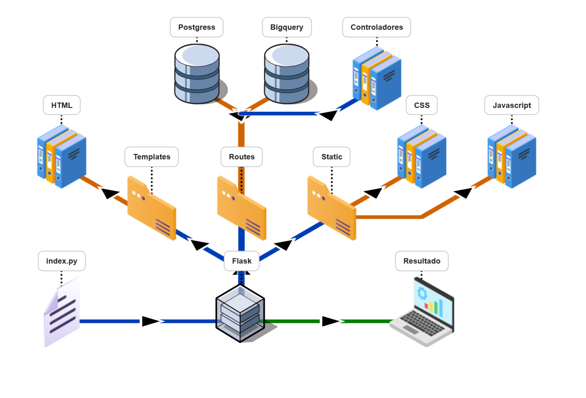
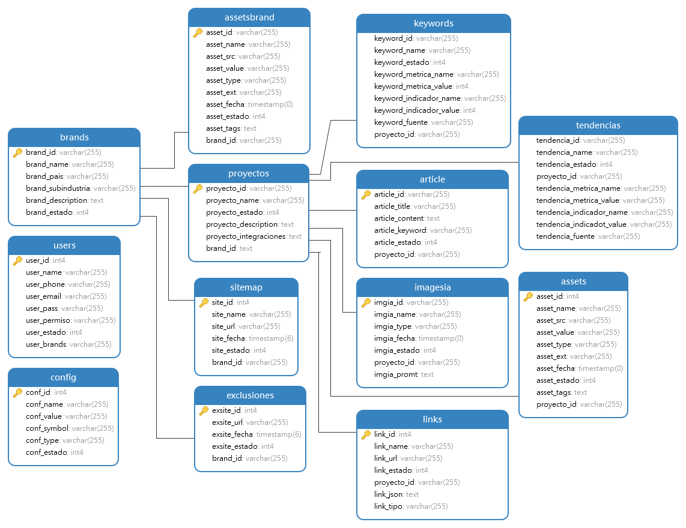

# GenIA Suite

> Este documento describe la arquitectura y el flujo de trabajo de la aplicación web GenIA Suite, construida sobre el framework Flask de Python.

## Visión General del Proyecto
GenIA Suite es una aplicación robusta diseñada para centralizar la gestión de marcas, colecciones, y la generación de contenido asistida por IA.

La aplicación utiliza un enfoque modular basado en Blueprints (Planos de Flask) para organizar la lógica de negocio, lo que permite un desarrollo y mantenimiento escalable.

## Tecnologías Principales

| Componente | Tecnología | Descripción |
| :--- | :--- | :--- |
| **Backend Principal** | Python 3 + Flask | Micro-framework ideal para desarrollar APIs y servicios web ligeros. |
| **Base de Datos** | PostgreSQL | Usado para el almacenamiento de los **datos principales de la aplicación** (Usuarios, Marcas, Configuración, etc.). |
| **Análisis/Datos** | BigQuery | Posiblemente usado para el manejo de **fuentes de datos grandes** o la realización de **analítica avanzada**. |
| **Frontend** | HTML (Jinja Templates), CSS, JavaScript | Encargado de la presentación al usuario y manejo de interacciones dinámicas (**peticiones AJAX**). |
| **Arquitectura** | Modular (Blueprints) | Diseño que facilita la organización del código en **módulos reutilizables e independientes**. |

## Arquitectura y Flujo de la Aplicación

El flujo de trabajo central de la aplicación se gestiona a través del archivo index.py y el patrón Modelo-Vista-Controlador (MVC), facilitado por los Blueprints de Flask.

### **1. El Orquestador:** index.py
* **Propósito:** Es el punto de entrada principal. Se encarga de la inicialización, la configuración de la base de datos (PostgreSQL/SQLAlchemy), y el registro de todos los módulos de ruta (Blueprints).

* **Arranque:** Decide si la aplicación se ejecuta en un entorno de Cloud (Producción) o Local (Desarrollo), configurando el puerto y el host automáticamente.

* **Ruta Raíz (/):** Dirige al usuario a la plantilla de inicio de sesión (templates/login.html).

### **2. Módulos de Rutas (routes/)**
El directorio routes es el corazón de la lógica de la aplicación y está dividido en módulos para mantener la claridad.

#### **Estructura de Módulos y Funcionalidades**

| Módulo/Directorio | Archivo | Funcionalidad Clave |
| :--- | :--- | :--- |
| **Autenticación** | `routes/sections/geniaauth.py` | Manejo de **inicio de sesión**, cierre de sesión y **gestión de la sesión** del usuario. |
| **Gestión de Marcas** | `routes/sections/brand/` | Módulos específicos para **crear, editar y listar Marcas**. |
| **Gestión de Proyectos** | `routes/sections/brandkit/` | Módulos específicos para **crear, editar y listar información sobre proyectos**. |
| **Gestión de Sistema** | `routes/sections/sistema/` | Módulos específicos para **crear, editar y listar información sobre el sistema**. |
| **Modelos** | `routes/models/` | **Definición de las tablas de la base de datos** (Ej. Users, Brands, etc.). |
| **Config** | `routes/config/` | **Definición de algunas configuraciones globales** |

### 3. El Flujo de Solicitud (Request/Response)

* **Solicitud del Cliente:** El navegador pide una URL (Ej. https://app.genia/brand/list).

* **Flask (index.py) recibe:** La aplicación en index.py dirige la solicitud al Blueprint registrado responsable (Ej. el módulo brand).

* **Lógica del Blueprint:** El código en el Blueprint (el "Controlador") interactúa con la base de datos (PostgreSQL o BigQuery) a través de los "Modelos" para obtener la información necesaria.

* **Renderizado de Plantilla:** El Blueprint usa la función render_template para combinar los datos obtenidos con el archivo HTML correspondiente (Ej. templates/sections/brand_list.html).

* **Respuesta al Cliente:** El HTML final (junto con CSS/JS de static/) se envía al navegador para mostrar el resultado.

## Estructura de Componentes para Mantenimiento
La estructura de carpetas facilita la localización de cualquier componente:

* **templates/:** Vistas (Frontend). Contiene todos los archivos .html (incluyendo login.html, perfil.html, y plantillas para las funcionalidades AJAX).

* **routes/:** Controladores y Modelos. Contiene la lógica de negocio modularizada.

* **static/:** Recursos Estáticos. Contiene todos los archivos CSS y JavaScript necesarios para dar estilo e interactividad a la interfaz.

* **config/:** Configuración de Conexiones. Contiene archivos como geniaconfig para variables sensibles y URLs de conexión (PostgreSQL, BigQuery, etc.).

    

## Esquema de la Base de Datos (PostgreSQL)

El sistema utiliza una base de datos relacional para gestionar la información central de la aplicación.

### Entidades Principales del Sistema

| Entidad | Descripción | Relación Clave |
| :--- | :--- | :--- |
| **users** | Almacena la información de los usuarios y sus credenciales. | **1:N** con `brands` (un usuario puede gestionar múltiples marcas). |
| **brands** | Núcleo del sistema. Información de las marcas (nombre, estado, etc.). | **1:N** con `proyectos`, `assetsbrand`, y otras tablas. |
| **proyectos** | Agrupación de trabajo bajo una marca específica. | Contiene `keywords`, `article`, `sitemap`, `imgiesla`, y `assets`. |
| **keywords** | Palabras clave relacionadas con un proyecto, incluyendo métricas y tendencias. | Relacionada con `proyectos` y `tendencias`. |
| **article** | Contenido de texto generado o almacenado (título, cuerpo). | Relacionada con `proyectos`. |
| **assetsbrand** | Activos a nivel de Marca (logos, documentos guía, etc.). | Relacionada con `brands`. |
| **assets** | Activos a nivel de Proyecto (imágenes generadas, archivos específicos). | Relacionada con `proyectos`. |

### Flujo de Datos del ERD

* **Centralización:** El modelo pivota alrededor de las tablas brands y proyectos. Toda la actividad de generación de contenido, activos, y gestión de palabras clave está ligada a un proyecto específico que, a su vez, pertenece a una marca.

* **Configuración:** La tabla config permite la gestión centralizada de variables del sistema.

* **Optimización SEO/Web:** Las tablas sitemap, links, y exclusiones indican la gestión de datos relacionados con la estructura web y SEO de los proyectos.

    

